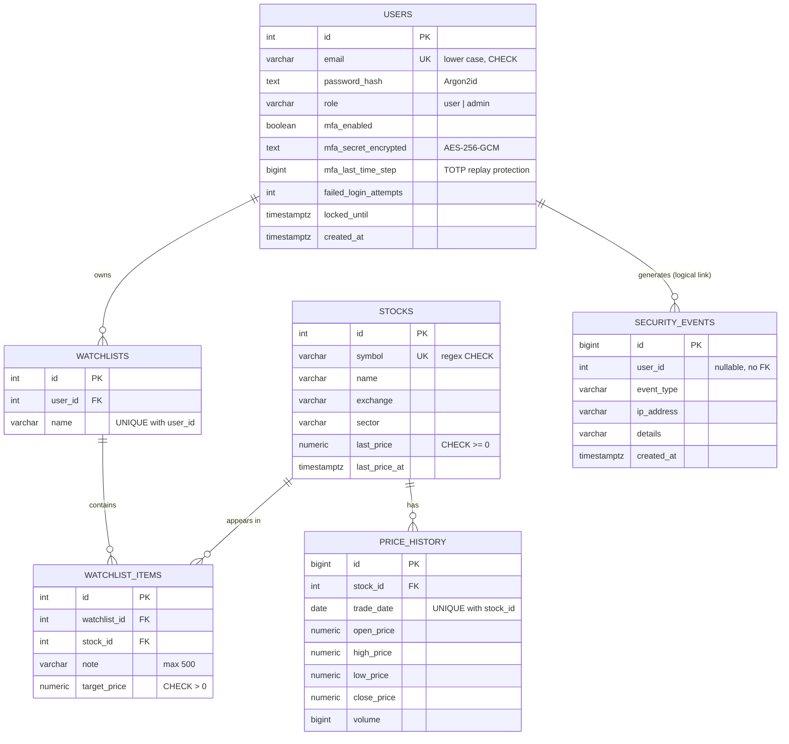

# Database design

Relational model implemented in PostgreSQL 16. The full DDL is in [`db/schema.sql`](../db/schema.sql).

## Entity-relationship diagram

`session` (used by `connect-pg-simple`) stores server-side sessions and is not part of the domain model.

## Normalisation

* **1NF** - every column is atomic; there are no repeating groups.
* **2NF** - every non-key attribute depends on the whole key. `watchlist_items` is the resolver table of the
  many-to-many relationship between watchlists and stocks; note and target price describe the pair, not one side.
* **3NF** - no transitive dependencies: the stock name, sector and price live only in `stocks`, the owner only in
  `watchlists`. `price_history` is separate from `stocks` because it is a one-to-many time series.
* `security_events.user_id` is on purpose not a foreign key, so the log is kept when an account is deleted.

## Constraints (data integrity)

| Table | Constraint | Purpose |
|---|---|---|
| `users` | `UNIQUE(email)`, `CHECK(email = lower(email))` | One account per address, case-insensitive |
| `users` | `CHECK(role IN ('user','admin'))` | Role-based access control |
| `users` | `CHECK(mfa_enabled = FALSE OR mfa_secret_encrypted IS NOT NULL)` | MFA cannot be "on" without a secret |
| `stocks` | `UNIQUE(symbol)`, regex `CHECK` on symbol, `CHECK(last_price >= 0)` | Valid ticker, no negative prices |
| `price_history` | `UNIQUE(stock_id, trade_date)`, `CHECK(high >= low)` | One candle per day, coherent OHLC |
| `watchlists` | `UNIQUE(user_id, name)` | No duplicate list names per user |
| `watchlist_items` | `UNIQUE(watchlist_id, stock_id)`, `CHECK(target_price > 0)` | A stock appears once per list |
All foreign keys use `ON DELETE CASCADE`: deleting a user removes their watchlists and items; deleting a
stock removes it from every list.

## Indexes

| Index | Query it serves |
|---|---|
| `users_email_key` (unique) | Login lookup by email |
| `stocks_symbol_key` (unique) | Stock detail page and symbol search |
| `stocks_sector_idx` | Sector filter on the catalogue |
| `price_history_stock_date_idx (stock_id, trade_date DESC)` | Latest N candles of a stock for the chart |
| `watchlist_items_stock_idx` | "Which items reference this stock" (cascade, admin counters) |
| `security_events_created_idx`, `security_events_user_idx` | Audit log views |
| `session_expire_idx` | Expired-session clean-up |

## CRUD map (DML)

| Feature | SELECT | INSERT | UPDATE | DELETE |
|---|---|---|---|---|
| Watchlists | `GET /watchlists`, `/watchlists/:id` | `POST /watchlists` | `POST /watchlists/:id/rename` | `POST /watchlists/:id/delete` |
| Watchlist items | (inside the watchlist page) | `POST /watchlists/:id/items` | `POST /watchlists/:id/items/:itemId/update` | `POST /watchlists/:id/items/:itemId/delete` |
| Stock catalogue (admin) | `GET /stocks`, `/admin/stocks` | `POST /admin/stocks` | `POST /admin/stocks/:id/update` | `POST /admin/stocks/:id/delete` |
| Account | `GET /account` | `POST /register` | MFA enable/disable | `POST /account/delete` |

Every query uses positional parameters (`$1`, `$2`, ...) through the `pg` driver, so user input is never concatenated
into SQL text. Ownership is enforced inside the query (`WHERE id = $1 AND user_id = $2`).
